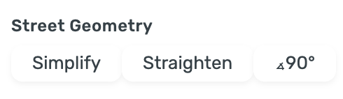
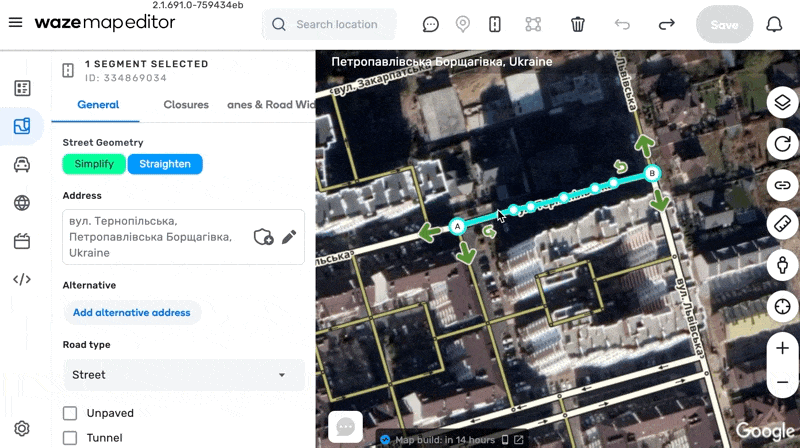
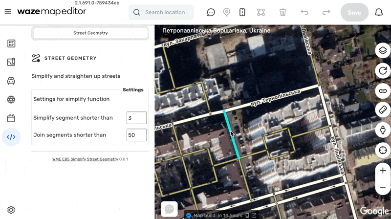
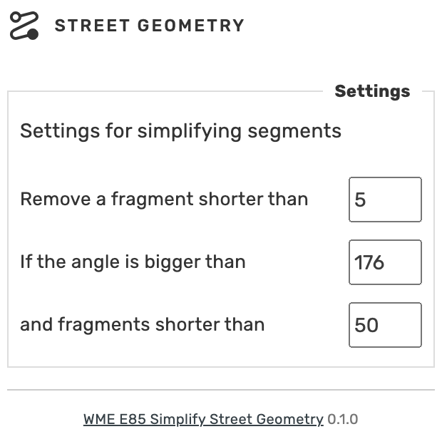
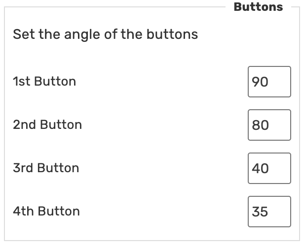

# WME 🇺🇦 E85
User script for Waze Map Editor.
Simplify and straighten up street geometry.

> This script is based on code of the old WME Simplify Street Geometry, but it works



## Functions

### Simplify



Removes part of the segment if it is shorter than 5 meters (default value)  
Join segment parts if they are shorter than 15 meters (default value)

### Straighten


Straighten up the street – choose one or more segments and align straight

### Orthogonalize



Orthogonalize two segments by 90 degrees

## Settings

### Simplify

Simplify method can be optimised by settings:



### Align streets by angle

Setup the buttons for change the angle between segments:



## Development

Source is TypeScript, built with Rollup into a single IIFE userscript.

```bash
npm install       # install dependencies
npm run build     # build dist/WME-E85.user.js
npm run watch     # rebuild on changes
```

Project structure:
- `src/` — TypeScript source and CSS
- `dist/` — built userscript (auto-committed by CI)
- `src/meta.ts` — userscript header with `{{version}}` placeholder
- `src/e85.ts` — main E85 class extending WMEBase

External dependencies loaded via `@require` (not bundled):
CommonUtils, GeoUtils, WME-Bootstrap, WME-Base, WME-UI

## Links

Author homepage: https://anton.shevchuk.name/
Author pet projects: https://hohli.com/
Support author: https://donate.hohli.com/
Script homepage: https://github.com/AntonShevchuk/wme-e85/
GreasyFork: https://greasyfork.org/en/scripts/456490-wme-e85-simplify-street-geometry
