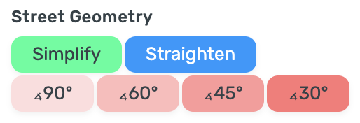

# WME E85
User script for Waze Map Editor.
Simplify Street Geometry in one click.

## Functions

### Simplify

Removes segment parts if it shorter than 3 meters (default value)
Removes node if segment parts shorter than 40 meters  (default value)

### Straighten

Straighten up the street – choose one or more segments and align straight

### Orthogonalize

Orthogonalize two segments by 90 degrees

## Settings

