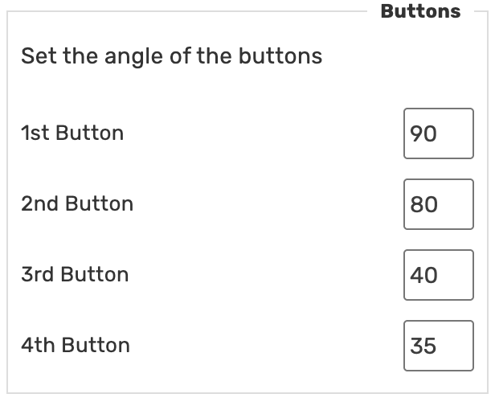

# WME 🇺🇦 E85
User script for Waze Map Editor.
Simplify and straighten up street geometry.

> This script is based on code of the old WME Simplify Street Geometry, but it works

## Functions

### Simplify

Removes part of the segment if it is shorter than 5 meters (default value)  
Join segment parts if they are shorter than 15 meters (default value)

### Straighten

Straighten up the street – choose one or more segments and align straight

### Orthogonalize

Orthogonalize two segments by 90 degrees

## Settings

### Simplify

Simplify method can be optimised by settings:

### Align streets by angle

Setup the buttons for change the angle between segments:

## Links

Author homepage: https://anton.shevchuk.name/  
Author pet projects: https://hohli.com/  
Support author: https://donate.hohli.com/  
Script homepage: https://github.com/AntonShevchuk/wme-e85/  
GreasyFork: https://greasyfork.org/en/scripts/456490-wme-e85-simplify-street-geometry
